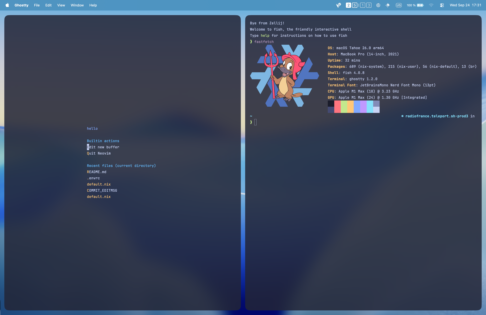

> [!WARNING]
> forked from https://github.com/Lalit64/snowflake

## Usage

### Nix-darwin

1. Enter devshell running `nix develop -c $SHELL` or using direnv using `direnv allow`
2. Switch to darwin configuration by running `nh darwin switch .`

### Home-manager

1. Enter devshell running `nix develop -c $SHELL` or using direnv using `direnv allow`
2. Switch to home-manager configuration by running `nh home switch .`

## Screenshot

