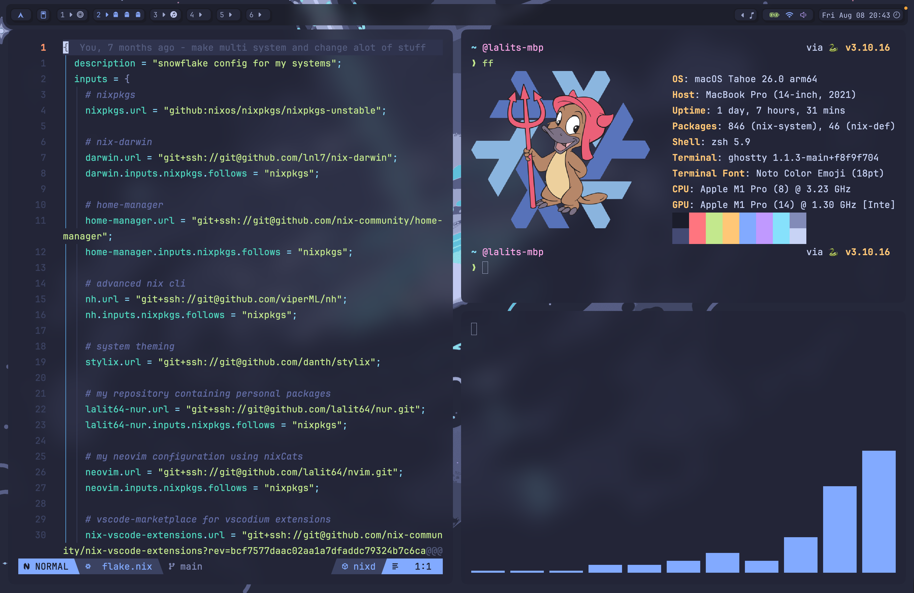
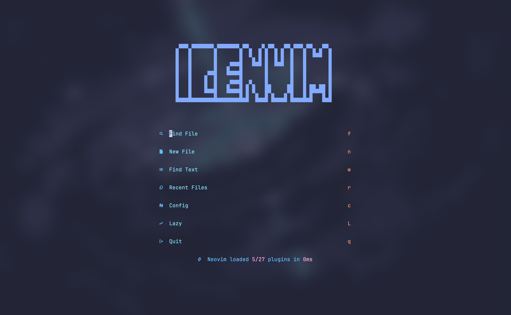

<h3 align="center">
 
    Snowflake
 
</h3>

<p align="center">
 <a href="https://github.com/lalit64/snowflake/stargazers"></a>
 <a href="https://github.com/lalit64/snowflake/commits"></a>
  <a href="https://wiki.nixos.org/wiki/Flakes" target="_blank">
 
</a>
<a href="https://github.com/snowfallorg/lib" target="_blank">
 
</a>
</p>

Welcome to my snowflake — a personalized nix configuration setup. This includes my custom nix-darwin and nixpkgs configurations, alongside various tools and personal adjustments designed to improve the overall Nix workflow.

## Table of Contents
1. [Getting Started](#getting-started)
2. [Features](#features)
3. [Customization](#customization)
4. [Exported Packages](#exported-packages)
5. [Screenshots](#screenshots)
6. [Resources](#resources)

## Getting Started

Before getting started, make sure that you have nix installed on your system. If not, you
can download and install it from the [Determinate Systems installer](https://github.com/DeterminateSystems/nix-installer).
Also make sure you have nix-darwin installed, as well. You can
follow the installation instruction on
[GitHub](https://github.com/LnL7/nix-darwin?tab=readme-ov-file#flakes).

### Clone this repository to your local machine

```bash

# clone 
git clone https://github.com/lalit64/snowflake.git ~/.config/snowflake
cd ~/.config/snowflake 

# macOS 
# first run without nix-darwin:
nix run github:lnl7/nix-darwin#darwin-rebuild -- switch --flake github:khaneliman/khanelinix

darwin-rebuild switch --flake .

# afterwards 
nh darwin switch
# or 
ns

```

## Features

Here's an overview of what my Nix configuration offers:

- **External Dependency Integrations**:
  - [nixCats](https://github.com/BirdeeHub/nixCats-nvim) based [neovim configuration](https://github.com/lalit64/nvim).

- **macOS Support**: Effortlessly set up and manage Nix on macOS with the help of [nix-darwin](https://github.com/LnL7/nix-darwin), while utilizing Homebrew for installing GUI applications.

- **Home Manager**: Manage your dotfiles, home environment, and user-specific configurations with [Home Manager](https://github.com/nix-community/home-manager).

## Customization

My Nix configuration, based on the
[snowfall-lib](https://github.com/snowfallorg/lib) structure, provides a
flexible and organized approach to managing your Nix environment. Here's how it
works:

- **Custom Library**: An optional custom library in the `lib/` directory
  contains a Nix function called with `inputs`, `snowfall-inputs`, and `lib`.
  The function should return an attribute set to merge with `lib`.

- **Modular Directory Structure**: You can create any (nestable) directory
  structure within `lib/`, `packages/`, `modules/`, `overlays/`, `systems/`, and
  `homes/`. Each directory should contain a Nix function that returns an
  attribute set to merge with the corresponding section.

- **Package Overlays**: The `packages/` directory includes an optional set of
  packages to export. Each package is instantiated with `callPackage`, and the
  files should contain functions that take an attribute set of packages and the
  required `lib` to return a derivation.

- **Modules for Configuration**: In the `modules/` directory, you can define
  NixOS modules for various platforms, such as `nixos`, `darwin`, and `home`.
  This modular approach simplifies system configuration management.

- **Custom Overlays**: The `overlays/` directory is for optional custom
  overlays. Each overlay file should contain a function that takes three
  arguments: an attribute set of your flake's inputs and a `channels` attribute
  containing all available channels, the final set of `pkgs`, and the previous
  set of `pkgs`. This allows you to customize package sets effectively.

- **System Configurations**: The `systems/` directory organizes system
  configurations based on architecture and format. You can create configurations
  for different architectures and formats, such as `x86_64-linux`,
  `aarch64-darwin`, and more.

- **Home Configurations**: Similar to system configurations, the `homes/`
  directory organizes home configurations based on architecture and format. This
  is especially useful if you want to manage home environments with Nix.

This structured approach to Nix configuration makes it easier to manage and
customize your Nix environment while maintaining flexibility and modularity.

# Screenshots




# Resources

Other configurations from where I learned and copied:

- [lalit64/dotfiles](https://github.com/lalit64/dotfiles) *My original config
- [Khaneliman/khanelinix](https://github.com/khaneliman/khanelinix) *Main
  inspiration and started with and also README template
- [JakeHamilton/config](https://github.com/jakehamilton/config)
- [NotAShelf/nyx](https://github.com/NotAShelf/nyx)
- [IogaMaster/snowfall-starter](https://github.com/IogaMaster/snowfall-starter)
